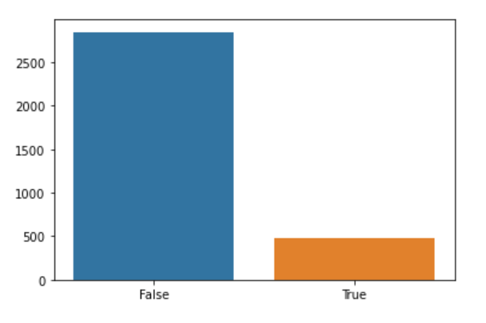
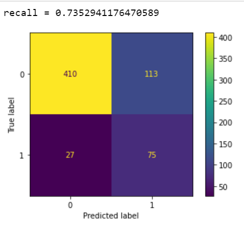
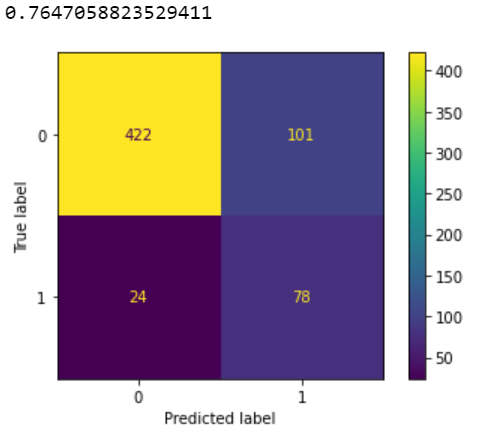
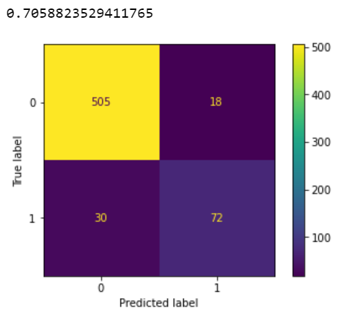
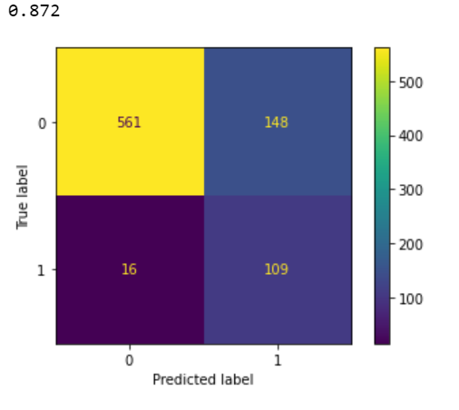

# SyriaTel Customer Churn Prediction
**Author:** Christopher Varghese

## Overview
For any business, especially services that are subscription based, it is important to maximize customer retention. The goal of this project was to predict if a customer was soon to churn by analyzing the data associated with customers that left or stayed with the service. Wether or not a customer would churn was expressed as a binary classification where the prediction would yield True if the customer was soon to churn and False if they weren't.

## Business and Data Understanding
Detecting if a customer is soon to churn can definitely increase customer retention rates provided there is a strategy to actually prevent them from churning. This may include offering them a promotion or exploring why they are churning and who they are seeking service from next.

The data is collected from SyriaTel, a telecom company. It was obtained as a csv file of 3,333 rows and 21(5 categorical and 16 numeric) columns. The column 'Churn' was isolated as the target where it was found to be True if the customer left and False if they stayed. The data was processed and the relationships between the features were examined while modelling.

## Data Preparation
The complete preparation can be found here: [final nb](./data-modeling.ipynb)

Categorical variables where encoded to numerical values for the modeling process. Dataframe was checked for null values and other imperfections.

## Exploratory Data Analysis
Complete analysis of features and experimentation can be found here: [experiment nb](./feature-engineering.ipynb)

In this graph, 0 refers to no churn while 1 means the customer did churn. The visualization shows that 85.6% of customers do not churn and 14.4% of customers do churn. This class imbalance helped me formulate my later process of resampling. I also created a correlation matrix which showed me the relationships of the features to the target in terms of R Squared.

Since we are concerned about the customers that did leave and only 15% of the customers from the data left, resampling may be helpful. We will also have to evaluate our models using recall. This is to measure the amount of false positives in our models which is the result we would like to avoid the most. In this case, a false positive is when we will predict a customer to stay with the service, when actually they are going to churn.

## Modeling
Before modeling, I set some data aside as unseen data that would be used for final model testing. The remaining data, which was 75% of the data, was used in the confusion matrices where it was split into a training set and validation set. The entireity of the training data was used for the cross validation process. The confusion matrices below are also labeled 0 for no churn and 1 for when a customer did churn.

**Logistic Regression Model**

This logistic regression was fitted after scaling and resampling the data. The cross validation(5 folds) of this model yielded recall scores of 0.71830986, 0.76388889, 0.68055556, 0.68055556, and 0.77464789, which average to be 0.7235915492957745. This means that on average, the model is able to predict 72.4% of the customers that will churn.

**KNN Model**

This KNN was fitted after scaling and resampling the data. The optimal value of k which is the parameter for the amount of nearest neighbors was found to be 33. The cross validation(5 folds) of this model yielded recall scores of 0.71830986, 0.84722222, 0.83333333, 0.79166667, and 0.87323944, which average to be 0.8127543035993741. This means that on average, the model is able to predict 81.28% of the customers that will churn. This is higher than the logisitic regressiion model and currently the best performing model.

**Random Forest Model**

The random forest model was fitted after scaling and resampling the data. The cross validation(5 folds) of this model yielded recall scores of 0.69014085, 0.75, 0.77777778, 0.70833333, and 0.74647887, which average to be 0.7345461658841941. This means that on average, the model is able to predict 73.45% of the customers that will churn. The margin is too close to tell wether this model is better than the logistic regression model, but is completely outperformed by the KNN model.

## Conclusions and Next Steps
**Final Model Testing**

The final model was the KNN model. This model included a pipeline that scaled and resampled the training data which helped the prediction power of the model. The model's parameters were tuned by testing the optimal value of k. The perfomance of the model on predicting all of the unseen test data was better than expected with a recall score of 87.2%. Since the testing data was unseen by the model up until this point, this test is comparable to the actual performance of the model in the real world. The cross validation(5 folds) on the entirety of the data yielded recall scores of 0.79381443, 0.78350515, 0.87628866, 0.83333333, and 0.82291667, for an average of 0.8219716494845362. My conclusion is that this model is proficient in predicting the number of customers soon to churn so this will be helpful to SyriaTel's inititiave of increasing customer retention.

**Next Steps**
Although this is a high performing model, there are improvements that can be made. Further tuning of the Random Forest model and more feature engineering may yield some improvement.

While this model is only able to predict customers that are soon to churn, it has no effect on wether these customers will churn or not. The next steps would be to implement various strategies for customer retention such as directly intervening with customers that are flagged by the model as soon to churn. If a successful strategy is implemented, SyriaTel may be capable of decreasing their churn rate which is currently 15%. Since the model currently does flag some customers that are not churning as soon to churn, it is important to evaluate a the costs and benefits of providing every customer that is flagged for churning a certain promotion or some kind of incentive not to churn. Finally, a secondary model can be explored after the business begins implementing various customer retention strategies to determine which strategies work and on which customers it has the highest probability of working on.

## Repo Structure
[README.md](./README.md) Overview of this project  
[data-modeling.ipynb](./data-modeling.ipynb) - Final Notebook  
[feature-engineering.ipynb](./feature-engineering.ipynb) - Notebook Used for Experimentation and EDA  
[data-exploration.ipynb](./data-exploration.ipynb) - Initial Notebook for cleaning(mostly unused)  
[customer-churn.csv](./customer-churn.csv) - dataset  
[resources](./resources) - Contains Images used in presentation and README  
[SyriaTel Customer Churn.pdf](./SyriaTel Customer Churn) - Presentation Slides
